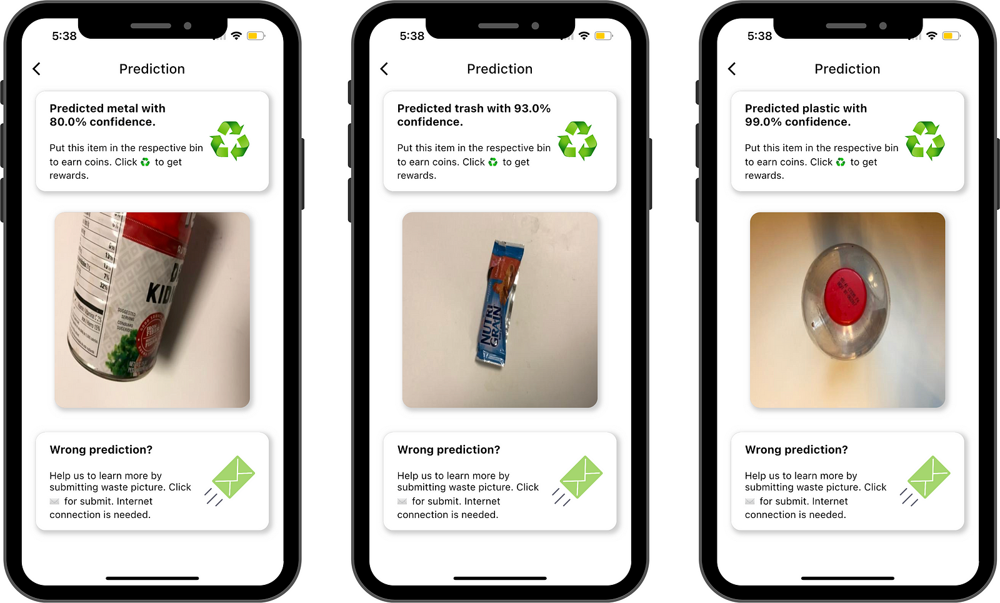

---
title: 'Deep-Waste: An app that manages household waste using deep learning'
tags:
  - Waste Classification
  - Machine Learning
  - Flutter
  - Firebase
  - Python
authors:
  - name: Suman Kunwar
    orcid: 0000-0002-4345-1050
    affiliation: "1" # (Multiple affiliations must be quoted)
affiliations:
 - name: Faculty of Computer Science, Selinus University of Sciences and Literature, Ragusa, Italy
   index: 1
date: 18 December 2023
bibliography: paper.bib

---

# Summary
Deep Waste is a mobile application that leverages state-of-the art computer vision and deep learning technologies to accurately classify waste materials into six categories: trash, plastic, paper, metal, glass, and cardboard. This innovative solution was developed to address the challenges of costly, imprecise, and unclear waste classification methods. Deep Waste has undergone rigorous testing on a variety of neural network architectures and real-world images, achieving an impressive average precision of 92% on the test set. By enabling efficient waste processing, reducing greenhouse gas emissions, and promoting sustainable practices, this app has the potential to transform the field of waste management.

# Statement of need

The escalating global waste crisis, projected to surge by 70% by 2050 without intervention [@kaza_what_2018], demands innovative solutions. Diverse waste management techniques, from source reduction to education initiatives, strive to combat this issue [@mridha_intelligent_2021, @mridha_intelligent_2021]. Yet, the absence of a standardized waste classification system results in regional disparities [@ferronato_waste_2019], emphasizing the need for efficient waste identification, crucial for integrated solid waste management [@fadhullah_household_2022].

Recent advancements leverage deep learning models to streamline waste sorting and management [@liu_image_2022]. These models, like RWNet and ConvoWaste, exhibit high accuracy, emphasizing the role of accurate waste disposal in mitigating climate change and reducing greenhouse gas emissions. Some studies incorporate IoT and waste grid segmentation to classify and segregate waste items in real time [@m_technical_2023].

Integration of machine learning models with mobile devices presents a promising avenue for precise waste management [@narayan_deepwaste:_2021]. The use of optimized deep learning techniques in an app demonstrates potential, achieving an accuracy of 0.881 in waste classification. However, limitations persist, prompting the introduction of MWaste, a mobile app employing computer vision to classify waste into six types. Tested on various neural network architectures, MWaste attains a remarkable 92% precision on the test set, functioning both online and offline.

# Workflow
The app uses the [TrashNet](https://github.com/garythung/trashnet) dataset to recognize different types of waste materials including plastic, glass, paper, and organic waste with various machine learning models, including InceptionV3 [@feng_office_2020], MobileNetV2 [@yong_application_2023], InceptionResnet V2 [@lee_novel_2021], ResNet [@girsang_convolutional_2022], MobileNet[@nurahmadan_mobile_2021], and Xception[@rismiyati_xception_2020].

The app also provides information on how to dispose of the waste and what recycling options are available. This approach can be customized to meet the user's specific needs, including local waste management regulations and individual household waste disposal habits and preferences. The home screen of the app is show in \autoref{fig:deep-waste-app}

{width="100%"}

The classification models are then converted into a lite format, such as [TFLite](https://www.tensorflow.org/lite/guide), which enables them to be used on mobile devices with limited resources. This format allows for fast loading times, smaller size, and compatibility with various programming languages and platforms. \autoref{fig:deep_waste_app_workflow} describes the overall workflow of the app.

{width="100%"}

The app's user interface is designed to be user-friendly and intuitive, making it easy for anyone to use. It can also be used in conjunction with other waste management services such as waste collection and recycling services. In addition, a leaderboard is generated based on the [CO2 preserved](https://stopwaste.co/calculator/) by recycling/composting.  The waste classification results are shown in \autoref{fig:waste_classification_results}.

{width="100%"}

The app can help households reduce the amount of waste they generate, increase their recycling rate, and reduce the amount of waste that ends up in landfills.

# References